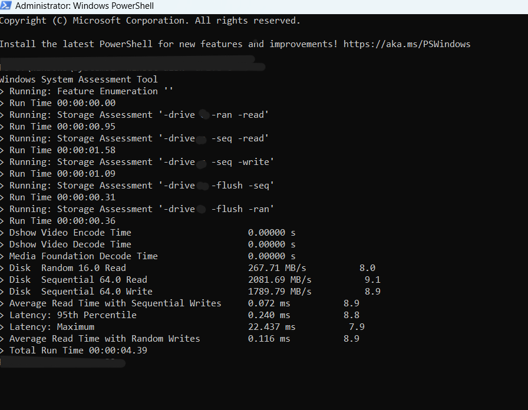
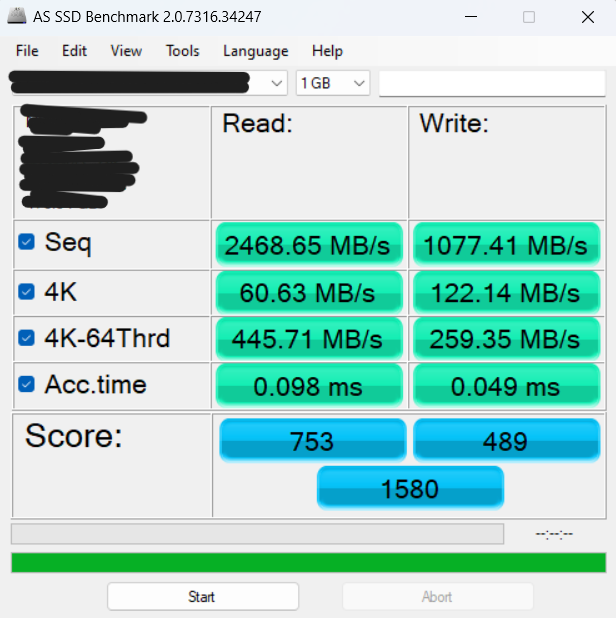
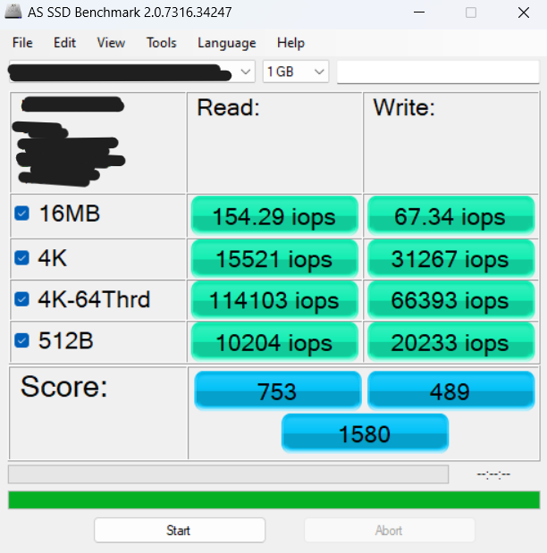

# SSD Benchmark Results

This section documents the performance benchmarks for the storage drives used in this project. Benchmarks were run using PowerShell and AS SSD Benchmark 2.0.7316.34247.

## Internal Drive Benchmark:

*   **Drive Model:** Internal NVMe SSD *(Specific model redacted)*
*   **Connection:** Internal PCIe NVMe Slot
*   **Test Date:** 23/04/2025
*   **Tool:** AS SSD Benchmark (1GB Test Size)

<br />

**winsat Benchmark Results:**
``` text
> Running: Feature Enumeration ''  
> Run Time 00:00:00.00  
> Running: Storage Assessment '-drive x -ran -read'  
> Run Time 00:00:00.95  
> Running: Storage Assessment '-drive x -seq -read'  
> Run Time 00:00:01.58  
> Running: Storage Assessment '-drive x -seq -write'  
> Run Time 00:00:01.09  
> Running: Storage Assessment '-drive x -flush -seq'  
> Run Time 00:00:00.31  
> Running: Storage Assessment '-drive x -flush -ran'  
> Run Time 00:00:00.36  
> Dshow Video Encode Time                      0.00000 s  
> Dshow Video Decode Time                      0.00000 s  
> Media Foundation Decode Time                 0.00000 s  
> Disk  Random 16.0 Read                       267.71 MB/s          8.0  
> Disk  Sequential 64.0 Read                   2081.69 MB/s          9.1  
> Disk  Sequential 64.0 Write                  1789.79 MB/s          8.9  
> Average Read Time with Sequential Writes     0.072 ms          8.9  
> Latency: 95th Percentile                     0.240 ms          8.8  
> Latency: Maximum                             22.437 ms          7.9  
> Average Read Time with Random Writes         0.116 ms          8.9  
> Total Run Time 00:00:04.39 
```
<br />

**AS SSD Benchmark Results (1GB Test):**
```text
AS SSD Benchmark 2.0.7316.34247
------------------------------
Name: Internal NVMe SSD
Firmware: [Redacted]
Controller: iaStorVD
Offset: 283648 K - OK
Size: 476.94 GB
Date: 23/04/2025 16:05:59
------------------------------
Sequential:
------------------------------
Read: 2468.65 MB/s
Write: 1077.41 MB/s
------------------------------
4K:
------------------------------
Read: 60.63 MB/s
Write: 122.14 MB/s
------------------------------
4K-64Threads:
------------------------------
Read: 445.71 MB/s
Write: 259.35 MB/s
------------------------------
Access Times:
------------------------------
Read: 0.098 ms
Write: 0.049 ms
------------------------------
Score:
------------------------------
Read: 753
Write: 489
Total: 1580
------------------------------
```

**IOPS Results:**
```text
AS SSD Benchmark 2.0.7316.34247
------------------------------
Name: Internal NVMe SSD
Firmware: [Redacted]
Controller: iaStorVD
Offset: 283648 K - OK
Size: 476.94 GB
Date: 23/04/2025 16:06:10
------------------------------
16MB
------------------------------
Read: 154.29 iops
Write: 67.34 iops
------------------------------
4K:
------------------------------
Read: 15521 iops
Write: 31267 iops
------------------------------
4K-64Threads:
------------------------------
Read: 114103 iops
Write: 66393 iops
------------------------------
512B
------------------------------
Read: 10204 iops
Write: 20233 iops
------------------------------
Score:
------------------------------
Read: 753
Write: 489
Total: 1580
------------------------------
```

**Interpretation:**
The internal NVMe SSD demonstrates strong performance, winsat and AS SSD show high sequential read speeds (>2400 MB/s) and good sequential write speeds initially (>1000 MB/s). The crucial 4K random read/write IOPS are solid (AS SSD showing 15K Read / 31K Write at QD1), indicating good responsiveness for OS and application loading. Access times are excellent (<0.1ms). Performance likely decreases on sustained writes larger than the drive's cache, overall, it provides a fast baseline for comparison.

## External SSD Benchmark (WD_BLACK SN770 + SSK Enclosure)

*   **Drive Model:** WD_BLACK SN770 NVMe SSD
*   **Enclosure Model:** SSK SHE-C325 (RTL9210B Chipset)
*   **Connection:** USB 3.2 Gen 1 (5Gbps) via USB-A Port
*   **Test Date:** [Enter Date When Tested]
*   **Tool:** AS SSD Benchmark (1GB Test Size)

**AS SSD Benchmark Results (1GB Test):**

**Interpretation:**
//interpratation 

## Screenshots

  

  


